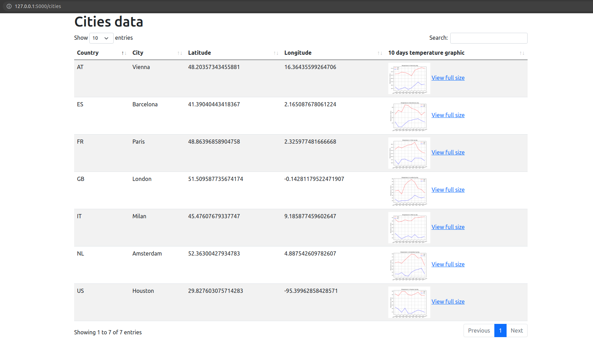

**About the project**

This is a CLI application with moderate web part,
that fetches addresses and analyses weather for given hotels locations.
Results are saved in output folder and presented on web page.

###### Built With
- SQLAlchemy
- Flask

**Getting Started**
###### Prerequisites
- Python 3.7 (or higher)
- PyPI pip 20.2.2 (or higher)
###### Installation
1. Clone the repo:
> git clone https://github.com/catpasternak/weather-app
2. Install dependencies from `requirements.txt`:
> pip install -r requirements.txt
3. Get free API keys at [mapquest.com](https://developer.mapquest.com/plan_purchase/steps/business_edition/business_edition_free/register)
and [openweathermap.org](https://openweathermap.org/api)
4. Replace API keys in `secret.py` with your API keys

###### Usage
Application is started from command line with 4 arguments.
Required arguments:
- _Source directory_: path to directory or zip file containing csv files with
hotels information
- _Output directory_: path to directory where results will be stored (may rather
exist or not)

Optional arguments:

- _Number of threads_ that will be used
for requesting data from geocoding and weather services.
Default value set to 4. Should be used with flag `--threads` or `-t`
- _Path to database system and file location_. Flag `--database` or `-d`.
Default 'sqlite:///db.sqlite3'. Current configuration is strongly recommended
since application was tested only with SQLite database engine.

Example:

>>> python3 console.py source_data/hotels.zip output_data --threads 4

Approximate execution time is 1 minute per 1000 hotels.
During data processing user gets notifications in terminal window.
After execution complete results can be accessed in _output directory_,
as well as on `localhost:5000`